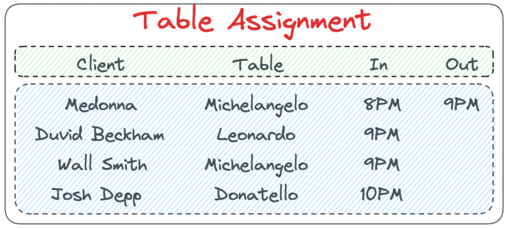
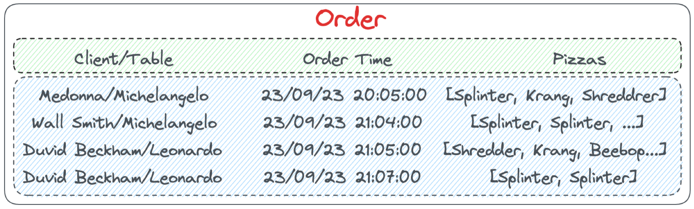
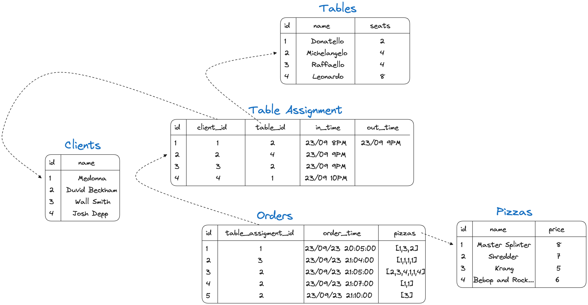
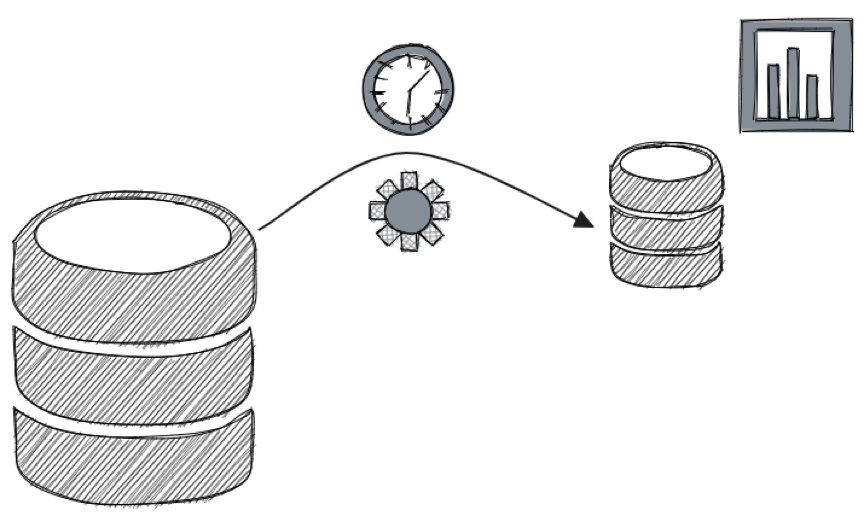
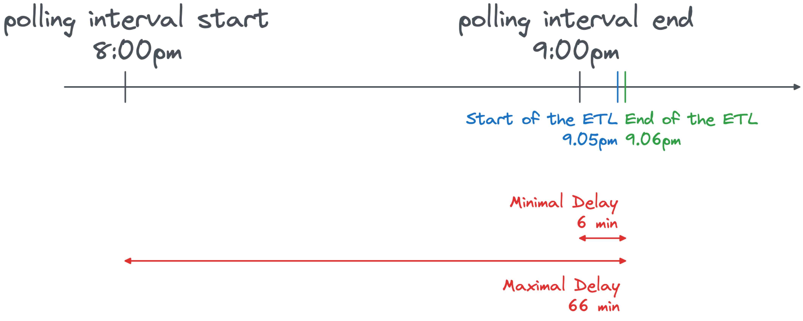
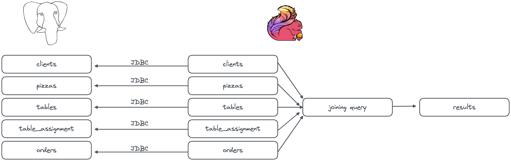

Data pipeline evolution from batch to streaming with Apache Flink®
==================================================================

The "Data pipeline evolution from batch to streaming with Apache Flink®" repository showcases an example of a data pipeline evolution from batch to streaming using Apache Flink® and Apache Kafka®. The repository provides a series of steps to reproduce a batch data pipeline in Apache Flink and then evolve it to a streaming data pipeline. The story addresses options, limits and edge cases of the solutions proposed.


Basic setup
===========

To follow the tutorial, you will need:

* A PostgreSQL database
* Apache Kafka cluster
* Apache Kafka Connect cluster with the PostgreSQL Debezium connector
* Apache Flink

You can create the above clusters, as managed services, using the Aiven free trial credits, by: 

* Accessing the [Aiven Console](https://go.aiven.io/francesco-signup)
* Creating an [Aiven access token](https://docs.aiven.io/docs/platform/howto/create_authentication_token)
* Copying the `.env.sample` file into the `.env` file and pasting the Aiven token
* Installing the [Aiven Client](https://docs.aiven.io/docs/tools/cli)
* Running the `scripts/create_environments.sh` script


The above script will:

* Create an Aiven for PostgreSQL service named `demo-postgresql-ninja`
* Create an Aiven for Apache Kafka service named `demo-kafka-ninja`
* Create an Aiven for Apache Flink service named `demo-flink-ninja`
* Create an integration between `demo-postgresql-ninja` and `demo-flink-ninja`
* Create an integration between `demo-kafka-ninja` and `demo-flink-ninja`
* Populate the `demo-postgresql-ninja` database with the `clients`, `pizzas`, `table_assignments` and `orders` tables

To destroy the test environment, execute `scripts/delete_environments.sh`


Story
=====

This is the story of a data pipeline evolution from batch to streaming.

Ninja Turtle pizzeria just opened their business. They have a limited amount of tables and want to optimize the service.


Their menu is fairly simple and includes 4 types of pizzas


Every time a client enters the restaurant, they take the name


And they record the table where the client is assigned to, noting down the time in and the time out once the customer exists the restaurant



Lastly, they record the customer order 



Ninja Turtle pizzeria uses PostgreSQL® in the backend to store the data in a set of tables like the following:



So far they have been using an ETL tool like Informatica to periodically extract the orders and submit them to the kitchen



The ETL is generating a query like the following, and executing it every hour at `hh+5 min` to fetch the orders for the previous hour:

```
select 
	orders.id order_id,
	clients.name client_name,
	tables.name table_name,
	JSON_AGG(
          JSON_BUILD_OBJECT( 
            'pizza', pizzas.name,
            'price', pizzas.price
            )
        )
from orders 
	join table_assignment on orders.table_assignment_id = table_assignment.id
	join pizzas on pizzas.id = ANY (orders.pizzas)
	join clients on table_assignment.client_id = clients.id
	join tables on table_assignment.table_id = tables.id
where order_time > date_trunc('hour',current_timestamp) - interval '1' hour 
and order_time <= date_trunc('hour',current_timestamp) 
group by 
    orders.id,
    clients.name,
    tables.name;
```

Obviously that's not great, adding between 5 minutes (lag) and an entire hour delay before starting the preparation of dishes. 



Therefore now, to minimize latency, they want to move away from the batch based approach and embrace streaming. They will use the combination of Apache Flink® and Apache Kafka®.

1st scenario: Use separated Apache Flink JDBC connectors
--------------------------------------------------------

The first test would be to keep the batch approach and just move the joining logic to Apache Flink. 
We can do it by mapping the five PostgreSQL tables into five Apache Flink table definition using the JDBC connector.



Check out how to implement the [separated JDBC connectors solution with Aiven for Apache Flink](how-to-aiven/01-basic-jdbc.md). 

The resulting joining SQL is very similar to what was used in PostgreSQL:

```sql
insert into order_output
select 
	src_orders.id order_id,
	src_clients.name client_name,
	src_tables.name table_name,
	LISTAGG(
          JSON_OBJECT( 
            'pizza' VALUE src_pizzas.name,
            'price' VALUE src_pizzas.price 
            )
        )
from src_orders cross join unnest(src_orders.pizzas) as pizza_unnest(pizza_id) 
  join src_pizzas on src_pizzas.id =  pizza_unnest.pizza_id
	join src_table_assignment on src_orders.table_assignment_id = src_table_assignment.id
	join src_clients on src_table_assignment.client_id = src_clients.id
	join src_tables on src_table_assignment.table_id = src_tables.id
where order_time > CEIL(LOCALTIMESTAMP to hour) - interval '1' hour 

group by 
    src_orders.id,
    src_clients.name,
    src_tables.name
    ;
```

Compared to the PostgreSQL SQL, The Flink SQL:

* Replaces the `CURRENT_TIMESTAMP` with `LOCALTIMESTAMP` and the `TRUNC` with the `CEIL` function
* Replaces the join beween `orders` and `pizzas` with a new join based on the `unnest` operation
* Replaces the `JSON_BUILD_OBJECT` and `JSON_AGG` with `JSON_OBJECT` and `LISTAGG` (even if the second is not 100% compatible, it allows the creation of a valid JSON)

**Pro and Cons of the solution**

Pro:

* ✅ We replicated what the original ETL into Flink
* ✅ We showcased the Apache Flink technology

Cons:
* ❌ Still batching
* ❌ Requires external scheduler
* ❌ Apache Flink will threat each of the JDBC connections as standalone
* ❌ No predicate pushdown - Each query is executed in isolation - Risk of inconsistency - what if a client changes table during the query time?

2nd scenario: Unique Apache Flink JDBC connector against a PostgreSQL view
--------------------------------------------------------------------------

In the second evolution, we tackle the consistency problem by retrieving a consistent dataset from PostgreSQL by creating a view.


Check out how to implement the [Unique JDBC connector against a PostgreSQL view with Aiven for Apache Flink](how-to-aiven/02-view-based-jdbc.md). 

In this case, since the joining logic is defined in PostgreSQL, the result Flink SQL is very minimal, with a filter to select only the latest changes:


```sql
insert into order_output
select 
  order_id, 
  client_name, 
  table_name, 
  pizzas 
from order_enriched_in 
where 
  order_time > CEIL(LOCALTIMESTAMP to hour) - interval '1' hour 
  and order_time <= CEIL(LOCALTIMESTAMP to hour)
```

**Pro and Cons of the solution**


Pro:

* ✅ We achieved consistency, compared to the previous solution

Cons:
* ❌ Still batching
* ❌ No streaming, basically using Flink as ETL tool replacement
* ❌ Possible problems when moving huge amount of data at once using the JDBC connector


License
============
Data pipeline evolution from batch to streaming with Apache Flink® is licensed under the Apache license, version 2.0. Full license text is available in the [LICENSE](LICENSE) file.

Please note that the project explicitly does not require a CLA (Contributor License Agreement) from its contributors.

Contact
============
Bug reports and patches are very welcome, please post them as GitHub issues and pull requests at https://github.com/aiven-labs/data-pipeline-evolution-batch-streaming-apache-flink . 
To report any possible vulnerabilities or other serious issues please see our [security](SECURITY.md) policy.
