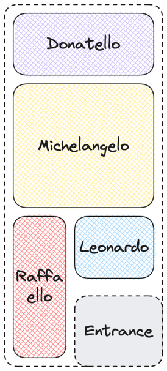
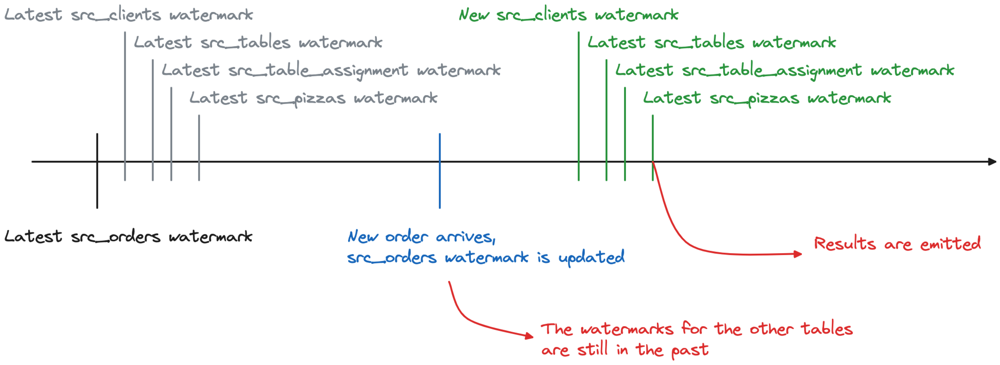

# Data pipeline evolution from batch to streaming with Apache Flink®


The "Data pipeline evolution from batch to streaming with Apache Flink®" repository showcases an example of a data pipeline evolution from batch to streaming using Apache Flink® and Apache Kafka®. The repository provides a series of steps to reproduce a batch data pipeline in Apache Flink and then evolve it to a streaming data pipeline. The story addresses options, limits and edge cases of the solutions proposed.


## Basic setup


To follow the tutorial, you will need:

* A PostgreSQL database
* Apache Kafka cluster
* Apache Kafka Connect cluster with the PostgreSQL Debezium connector
* Apache Flink

You can create the above clusters, as managed services, using the Aiven free trial credits, by: 

* Accessing the [Aiven Console](https://go.aiven.io/francesco-signup)
* Creating an [Aiven access token](https://docs.aiven.io/docs/platform/howto/create_authentication_token)
* Copying the `.env.sample` file into the `.env` file and pasting the Aiven token
* Installing the [Aiven Client](https://docs.aiven.io/docs/tools/cli)
* Running the `scripts/create_environments.sh` script


The above script will:

* Create an Aiven for PostgreSQL service named `demo-postgresql-ninja`
* Create an Aiven for Apache Kafka service named `demo-kafka-ninja`
* Create an Aiven for Apache Flink service named `demo-flink-ninja`
* Create an integration between `demo-postgresql-ninja` and `demo-flink-ninja`
* Create an integration between `demo-kafka-ninja` and `demo-flink-ninja`
* Populate the `demo-postgresql-ninja` database with the `clients`, `pizzas`, `table_assignments` and `orders` tables

To destroy the test environment, execute `scripts/delete_environments.sh`


## Story


This is the story of a data pipeline evolution from batch to streaming.

Ninja Turtle pizzeria just opened their business. They have a limited amount of tables and want to optimize the service.



Their menu is fairly simple and includes 4 types of pizzas


Every time a client enters the restaurant, they take the name


And they record the table where the client is assigned to, noting down the time in and the time out once the customer exists the restaurant


Lastly, they record the customer order 


Ninja Turtle pizzeria uses PostgreSQL® in the backend to store the data in a set of tables like the following:


So far they have been using an ETL tool like Informatica to periodically extract the orders and submit them to the kitchen


The ETL is generating a query like the following, and executing it every hour at `hh+5 min` to fetch the orders for the previous hour:

```
select 
	orders.id order_id,
	clients.name client_name,
	tables.name table_name,
	JSON_AGG(
          JSON_BUILD_OBJECT( 
            'pizza', pizzas.name,
            'price', pizzas.price
            )
        )
from orders 
	join table_assignment on orders.table_assignment_id = table_assignment.id
	join pizzas on pizzas.id = ANY (orders.pizzas)
	join clients on table_assignment.client_id = clients.id
	join tables on table_assignment.table_id = tables.id
where order_time > date_trunc('hour',current_timestamp) - interval '1' hour 
and order_time <= date_trunc('hour',current_timestamp) 
group by 
    orders.id,
    clients.name,
    tables.name;
```

Obviously that's not great, adding between 5 minutes (lag) and an entire hour delay before starting the preparation of dishes. 


Therefore now, to minimize latency, they want to move away from the batch based approach and embrace streaming. They will use the combination of Apache Flink® and Apache Kafka®.

## 1st scenario: Use separated Apache Flink JDBC connectors


The first test would be to keep the batch approach and just move the joining logic to Apache Flink. 
We can do it by mapping the five PostgreSQL tables into five Apache Flink table definition using the JDBC connector.


Check out how to implement the [separated JDBC connectors solution with Aiven for Apache Flink](how-to-aiven/01-basic-jdbc.md). 

The resulting joining SQL is very similar to what was used in PostgreSQL:

```sql
insert into order_output
select 
	src_orders.id order_id,
	src_clients.name client_name,
	src_tables.name table_name,
	JSON_ARRAYAGG(
          JSON_OBJECT( 
            'pizza' VALUE src_pizzas.name,
            'price' VALUE src_pizzas.price 
            )
        )
from src_orders cross join unnest(src_orders.pizzas) as pizza_unnest(pizza_id) 
  join src_pizzas on src_pizzas.id =  pizza_unnest.pizza_id
	join src_table_assignment on src_orders.table_assignment_id = src_table_assignment.id
	join src_clients on src_table_assignment.client_id = src_clients.id
	join src_tables on src_table_assignment.table_id = src_tables.id
where order_time > CEIL(LOCALTIMESTAMP to hour) - interval '1' hour 

group by 
    src_orders.id,
    src_clients.name,
    src_tables.name
    ;
```

Compared to the PostgreSQL SQL, The Flink SQL:

* Replaces the `CURRENT_TIMESTAMP` with `LOCALTIMESTAMP` and the `TRUNC` with the `CEIL` function
* Replaces the join beween `orders` and `pizzas` with a new join based on the `unnest` operation
* Replaces the `JSON_BUILD_OBJECT` and `JSON_AGG` with `JSON_OBJECT` and `JSON_ARRAYAGG`

## Pros and Cons of the solution

Pros:

* ✅ We replicated what the original ETL into Flink
* ✅ We showcased the Apache Flink technology

Cons:
* ❌ Still batching
* ❌ Requires external scheduler
* ❌ Apache Flink will threat each of the JDBC connections as standalone
* ❌ No predicate pushdown - Each query is executed in isolation
* ❌ Possible problems with huge data volumes hosting lots of not filtered data

  ```
  [ERROR] Could not execute SQL statement. Reason:
  java.lang.OutOfMemoryError: Java heap space. A heap space-related out-of-memory error has occurred. This can mean two things: either Flink Master requires a larger size of JVM heap space or there is a memory leak. In the first case, 'jobmanager.memory.heap.size' can be used to increase the amount of available heap memory. If the problem is not resolved by increasing the heap size, it indicates a memory leak in the user code or its dependencies which needs to be investigated and fixed. The Flink Master has to be shutdown...
  ```
* ❌ Risk of inconsistency - what if a client changes table during the query time?

## 2nd scenario: Unique Apache Flink JDBC connector against a PostgreSQL view


In the second evolution, we tackle the consistency problem by retrieving a consistent dataset from PostgreSQL by creating a view.


Check out how to implement the [Unique JDBC connector against a PostgreSQL view with Aiven for Apache Flink](how-to-aiven/02-view-based-jdbc.md). 

In this case, since the joining logic is defined in PostgreSQL, the result Flink SQL is very minimal, with a filter to select only the latest changes:


```sql
insert into order_output
select 
  order_id, 
  client_name, 
  table_name, 
  pizzas 
from order_enriched_in 
where 
  order_time > CEIL(LOCALTIMESTAMP to hour) - interval '1' hour 
  and order_time <= CEIL(LOCALTIMESTAMP to hour)
```

## Pros and Cons of the solution


Pros:

* ✅ We achieved consistency, compared to the previous solution

Cons:
* ❌ Still batching
* ❌ No streaming, basically using Flink as ETL tool replacement
* ❌ Possible problems when moving huge amount of data at once using the JDBC connector

## 3rd scenario: CDC connector against the `orders` table + JDBC lookup to the PostgreSQL view

In the third scenario, we start moving towards the streaming phase. We do it by keeping the PostgreSQL view, but having Flink to react to each order submitted by creating a dedicated Change Data Capture (CDC) flow. Therefore, whenever a new order is caught by the CDC flow, a lookup using the JDBC connector will retrieve the entire order status.

We can achieve the CDC by:

* using the [Apache Flink CDC connector for PostgreSQL](https://docs.aiven.io/docs/products/flink/howto/pg-cdc-connector)

  

  Check out how to implement the [Apache Flink CDC connector for PostgreSQL + JDBC lookup to the PostgreSQL view with Aiven for Apache Flink](how-to-aiven/03-flink-cdc-jdbc.md). 

* including Apache Kafka in the picture and creating a [Debezium Source connector to PostgreSQL](https://docs.aiven.io/docs/products/kafka/kafka-connect/howto/debezium-source-connector-pg)

  
  
  Check out how to implement the [Apache Kafka CDC connector for PostgreSQL + JDBC lookup to the PostgreSQL view with Aiven for Apache Flink](how-to-aiven/03-kafka-cdc-flink-jdbc.md). 

In both cases, since the joining SQL is defined in PostgreSQL, the transformation SQL only needs to handle the JDBC lookup every time a new order is entered and tracked by the CDC pipeline. This is done with [Apache Flink lookup joins](https://nightlies.apache.org/flink/flink-docs-master/docs/dev/table/sql/queries/joins/#lookup-join).

```
INSERT INTO order_output
select order_id, client_name, table_name, json_agg 
from orders_cdc
join order_enriched_in FOR SYSTEM_TIME AS of order_enriched_in.proctime
on order_enriched_in.order_id=orders_cdc.id
```

### When using direct CDC in Flink vs Apache Kafka CDC?

Apache Flink offers a [wide range of CDC connectors](https://ververica.github.io/flink-cdc-connectors/master/) able to track changes from several of the most popular databases including PostgreSQL, Oracle, SQL Server, MySQL amongst others. Therefore including Apache Kafka in the mix seems useless only to over complicate the architecture, but it can be useful where the table being tracked will be used several times across different use cases. Being able to retrieve the data from the database once and play it several times could be useful to limit the overhead on the source database. Moreover there can be small discrepancies between the metadata exposed by the [Kafka Debezium Source Connector in PostgreSQL](https://debezium.io/documentation/reference/stable/connectors/postgresql.html#postgresql-transaction-metadata) and the ones from the [Flink CDC connector](https://ververica.github.io/flink-cdc-connectors/master/content/connectors/postgres-cdc.html#available-metadata).

Summarizing:

* Use the **Flink CDC Connector** when:
  * The source table needs to be used once
  * The [exposed metadata are enough for your logic](https://debezium.io/documentation/reference/stable/connectors/postgresql.html#postgresql-transaction-metadata)
* Add **Apache Kafka and the Debezium connector** in the architecture when:
  * The source table needs to be used by various consumers
  * Some of the metadata (like [transaction boundaries](https://debezium.io/documentation/reference/stable/connectors/postgresql.html#postgresql-transaction-metadata)) are only available in the Debezium connector


### Pros and Cons of the solution


Pros:

* ✅ We achieved streaming, as soon as an order is emitted, it's tracked and the Flink pipeline processes it

Cons:
* ❌ Even if we are doing a Database lookup, we could get some inconsistent results

### Problem with fast database changes


When using the Lookup method, the following happens:

1. A new row is added/edited/deleted from the `orders` table
2. Apache Flink (or Apache Kafka and then Apache Flink) CDC reads the change
3. The lookup to the joining view in the database happens filtered for the new order `id`
4. The result is joined with the CDC stream by the lookup join
5. The lookup data is then pushed to the Flink sink

If a change in the same order `id` happens in the database between the steps `1` and `3`, then we'll display an inconsistent state.


In the above scenario, the following will happen:

1. The new order is added with the following details

```json
{
    "id": 100, 
    "table_assigment": 4, 
    "order_time": "23/09/2023 11PM", 
    "pizzas": [2,3,3]
}
```

2. The CDC task tracks the changes into Flink

3. Before the Lookup is performed, a new change edits the same id `100` order changing the pizzas to `{1,1,1}`

```json
{
    "id": 100, 
    "table_assigment": 4, 
    "order_time": "23/09/2023 11PM", 
    "pizzas": [1,1,1]
}
```

4. The lookup happens, and, since the view is consistent with the table, the `"pizzas": [1,1,1]` is pushed to the sink
5. The update change in step `3` is tracked by the CDC task tracks the changes into Flink
6. A new lookup happens, and the `"pizzas": [1,1,1]` is pushed again to the sink

This basic example showcases a potential inconsistency problem to be evaluated when using the lookup approach.

## 4th scenario: Outbox pattern and the CDC connector

In the fourth scenario we are looking to solve the consistency problem defined above. The standard approach is to use the **outbox pattern** where, every time we insert an line into the `order` table, we also write the result of the join into an outbox table, which is then CDC'ed either via direct Flink or Apache Kafka. The pro of the outbox patter is that it guarantees consistency since all DML operations can happen within the same transaction.

* Using the Apache Flink CDC connector

  

* Using the Apache Kafka Debezium connector and the Apache Flink Kafka connector

  

In both cases (direct Flink CDC or via Kafka), the Flink SQL is extremely basic, since we have in input the data as we want to shape it for the output.

```sql
INSERT INTO order_output
select * from order_outbox;
```

Check out how to implement the [Outbox pattern and the CDC connector with Aiven for Apache Flink](how-to-aiven/04-flink-cdc-outbox.md). 

### Requires a change in the DML statements

The outbox pattern requires modification in the DML operations (insert/update/deletes) in order to feed both the original tables as well as the outbox table. If, in our example, we create an outbox table called `orders_outbox` as

```sql
create table orders_outbox (
  order_id int,
  client_name text,
  table_name text,
  pizzas json
);
```

And, every time we receive an order, we'll have a transaction like the below that inserts it into the `ORDERS` table and then fetches the joined data from all the tables to insert into the `ORDERS_OUTBOX` table:

```sql
BEGIN;
DO
  $$
  DECLARE
    INSERTED_ORDER_ID INT;
  BEGIN

  INSERT INTO ORDERS 
    (TABLE_ASSIGNMENT_ID, ORDER_TIME, PIZZAS) 
    VALUES (2, CURRENT_TIMESTAMP, '{1,2,3,4}') RETURNING id into INSERTED_ORDER_ID;
  INSERT INTO ORDERS_OUTBOX
    select 
      orders.id order_id,
      clients.name client_name,
      tables.name table_name,
      JSON_AGG(
              JSON_BUILD_OBJECT( 
                'pizza', pizzas.name,
                'price', pizzas.price
                )
            )
    from orders 
      join table_assignment on orders.table_assignment_id = table_assignment.id
      join pizzas on pizzas.id = ANY (orders.pizzas)
      join clients on table_assignment.client_id = clients.id
      join tables on table_assignment.table_id = tables.id
    where orders.id=INSERTED_ORDER_ID 
    group by 
        orders.id,
        clients.name,
        tables.name;
  END;
  $$;
END; 
```

### Pros and Cons of the solution


Pros:

* ✅ We achieved streaming, as soon as an order is emitted, it's tracked and the Flink pipeline processes it

Cons:
* ❌ We require a change in the DML operation, not always possible
* ❌ We store the data twice (one for `orders`, one for `order_outbox`)

## 5th scenario: Outbox pattern with PostgreSQL logical decoding messages and Kafka CDC connector

In the fifth scenario, we remove the need for double storage that we had in the previous solution, by using PostgreSQL logical decoding messages and Debezium to read them into Apache Kafka. 


While technically possible with the direct Apache Flink CDC connector, the selected solution includes Apache Kafka Debezium connector.

Check out how to implement the [Outbox pattern and the CDC connector with Aiven for Apache Kafka and Aiven for Apache Flink](how-to-aiven/05-kafka-flink-cdc-outbox-logical-decoding.md).

In this solution, the transformation SQL below needs to:

* decode the `message.content` section from base64 with the `FROM_BASE64` function
* extract the relevant pieces of information from the payload using the `JSON_VALUE` and `JSON_QUERY` functions

```sql
INSERT into order_output
select 
    JSON_VALUE(FROM_BASE64(message.content), '$.order_id'  RETURNING INT),
    JSON_VALUE(FROM_BASE64(message.content), '$.client_name'),
    JSON_VALUE(FROM_BASE64(message.content), '$.table_name'), 
    JSON_QUERY(FROM_BASE64(message.content), '$.pizzas[*]')
from pg_messages
```


### Requires a change in the DML statements

The outbox pattern using logical decoding messages doesn't require an additional table but still requires a modification in the DML operations (insert/update/deletes) in order to emit the new message and feed the original tables. If, in our example, every time we receive an order, we'll have a transaction like the below that inserts it into the `ORDERS` table and then fetches the joined data from all the tables to creates a new logical decoding message:

```sql
BEGIN;
DO
  $$
  DECLARE
    INSERTED_ORDER_ID INT;
    JSON_ORDER text;
  BEGIN

  INSERT INTO ORDERS 
    (TABLE_ASSIGNMENT_ID, ORDER_TIME, PIZZAS) 
    VALUES (2, CURRENT_TIMESTAMP, '{1,2,3,4}') RETURNING id into INSERTED_ORDER_ID;
  
  select JSONB_BUILD_OBJECT(
      'order_id', orders.id,
      'client_name', clients.name,
      'table_name', tables.name,
      'pizzas',
      JSONB_AGG(
              JSONB_BUILD_OBJECT( 
                'pizza', pizzas.name,
                'price', pizzas.price
                )
            )
    ) into JSON_ORDER
    from orders 
      join table_assignment on orders.table_assignment_id = table_assignment.id
      join pizzas on pizzas.id = ANY (orders.pizzas)
      join clients on table_assignment.client_id = clients.id
      join tables on table_assignment.table_id = tables.id
    where orders.id=INSERTED_ORDER_ID 
    group by 
        orders.id,
        clients.name,
        tables.name;

    SELECT * FROM pg_logical_emit_message(true,'myprefix',JSON_ORDER) into JSON_ORDER;
  END;
  $$;
END; 
```

Once created the Apache Kafka Debezium source connector and executed the above, a new message will appear in the `my_pg.messages` topic (concatenation of server prefix and `messages`) containing the logical decoding message defined above in the `message.content` part of the value payload.

### Pros and Cons of the solution


Pros:

* ✅ We achieved streaming, as soon as an order is emitted, it's tracked and the Flink pipeline processes it
* ✅ Data is stored once

Cons:
* ❌ We require a change in the DML operation, not always possible

## 6th scenario: Direct table CDC and consistency in Apache Flink

In the sixt scenario, we remove the need for changes in DML operation by creating CDC connectors from Apache Flink (or Apache Kafka) and recreating consistent joins in Apache Flink. 


While technically possible with the direct Apache Flink CDC connector, some limitation like the lack of support for arrays made the selected solution including Apache Kafka Debezium connector.

Check out how to implement the [Outbox pattern and the CDC connector with Aiven for Apache Kafka and Aiven for Apache Flink](how-to-aiven/05-kafka-flink-cdc-outbox-logical-decoding.md).

In this solution, the transformation SQL below is complex since we have to recreate the consistency by either:

* creating [temporal joins](https://nightlies.apache.org/flink/flink-docs-release-1.15/docs/dev/table/sql/queries/joins/#temporal-joins) based on the transaction time
* adding a more complex logic to evaluate the transaction ids, and the [rich transaction metadata](https://debezium.io/documentation/reference/stable/connectors/postgresql.html#postgresql-transaction-metadata) provided by the Debezium connector. In this second case, we don't only have a transaction id, but also a count of the events in the transaction, that we can use to emit changes only when all the events in a transaction have been read. 


The following SQL showcase the temporal join use case:

```sql
INSERT INTO order_output
select 
  src_orders.id order_id,
	src_clients.name client_name,
	src_tables.name table_name,
	JSON_ARRAYAGG( 
          JSON_OBJECT( 
            'pizza' VALUE src_pizzas.name,
            'price' VALUE src_pizzas.price 
            )
        )
from src_orders cross join unnest(src_orders.pizzas) as pizza_unnest(pizza_id) 
  join src_pizzas FOR SYSTEM_TIME AS of src_orders.event_time  
  on src_pizzas.id =  pizza_unnest.pizza_id
  join src_table_assignment  FOR SYSTEM_TIME AS of src_orders.event_time 
  on src_orders.table_assignment_id = src_table_assignment.id
  join src_clients  FOR SYSTEM_TIME AS of src_orders.event_time 
  on src_table_assignment.client_id = src_clients.id
  join src_tables  FOR SYSTEM_TIME AS of src_orders.event_time 
  on src_table_assignment.table_id = src_tables.id
group by src_orders.id,
  src_clients.name,
	src_tables.name;
```

### Pros and Cons of the timestamp solution


Pros:

* ✅ No Changes needed in DML
* ✅ Changes are read in streaming mode from the database

Cons:
* ❌ By default, results are not emitted until all watermarks on all tables present in the join have been passed

From the [docs](https://nightlies.apache.org/flink/flink-docs-release-1.17/docs/dev/table/sql/queries/joins/#processing-time-temporal-join)

> Note The reason why the FOR SYSTEM_TIME AS OF syntax used in temporal join with latest version of any table/view is not support is only the semantic consideration, because the join processing for left stream doesn’t wait for the complete snapshot of temporal table, this may mislead users in production environment. The processing-time temporal join by temporal table function also exists same semantic problem, but it has been alive for a long time, thus we support it from the perspective of compatibility.

Basically the following is happening:



Possible solutions:

* [Idle Timeout](https://nightlies.apache.org/flink/flink-docs-master/docs/dev/table/config/#table-exec-source-idle-timeout) - risk of losing consistency for temporary network/consumption hiccups
* [Interval Joins](https://nightlies.apache.org/flink/flink-docs-master/docs/dev/table/sql/queries/joins/#interval-joins) - risk of losing consistency for temporary network/consumption hiccups 
* Database triggers to periodically insert/update a row in each of the table - additional load in the database


### Pros and Cons of the transaction id joins solution


Pros:

* ✅ No Changes needed in DML
* ✅ Changes are read in streaming mode from the database
* ✅ Results are emitted once the full transaction has been processed


Cons:
* ❌ Complex query to handle in Flink
* ❌ Possibly large state to manage


## License

Data pipeline evolution from batch to streaming with Apache Flink® is licensed under the Apache license, version 2.0. Full license text is available in the [LICENSE](LICENSE) file.

Please note that the project explicitly does not require a CLA (Contributor License Agreement) from its contributors.

## Contact

Bug reports and patches are very welcome, please post them as GitHub issues and pull requests at https://github.com/aiven-labs/data-pipeline-evolution-batch-streaming-apache-flink . 
To report any possible vulnerabilities or other serious issues please see our [security](SECURITY.md) policy.
