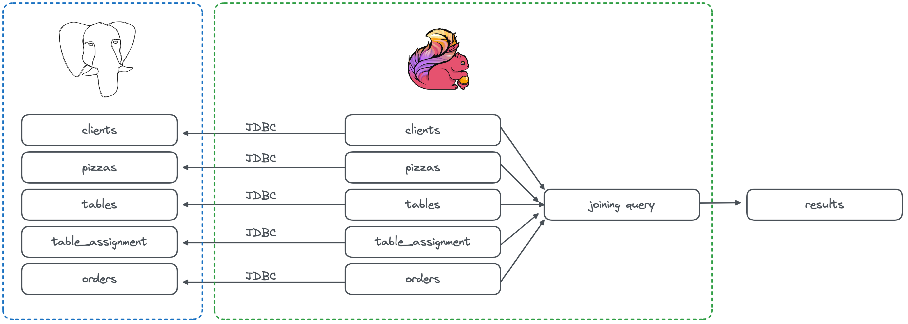

Data pipeline evolution from batch to streaming with Apache Flink®
==================================================================

The "Data pipeline evolution from batch to streaming with Apache Flink®" repository showcases an example of a data pipeline evolution from batch to streaming using Apache Flink® and Apache Kafka®. The repository provides a series of steps to reproduce a batch data pipeline in Apache Flink and then evolve it to a streaming data pipeline. The story addresses options, limits and edge cases of the solutions proposed.


Basic setup
===========

To follow the tutorial, you will need:

* A PostgreSQL database
* Apache Kafka cluster
* Apache Kafka Connect cluster with the PostgreSQL Debezium connector
* Apache Flink

You can create the above clusters, as managed services, using the Aiven free trial credits, by: 

* Accessing the [Aiven Console](https://go.aiven.io/francesco-signup)
* Creating an [Aiven access token](https://docs.aiven.io/docs/platform/howto/create_authentication_token)
* Copying the `.env.sample` file into the `.env` file and pasting the Aiven token
* Installing the [Aiven Client](https://docs.aiven.io/docs/tools/cli)
* Running the `scripts/create_environments.sh` script


The above script will:

* Create an Aiven for PostgreSQL service named `demo-postgresql-ninja`
* Create an Aiven for Apache Kafka service named `demo-kafka-ninja`
* Create an Aiven for Apache Flink service named `demo-flink-ninja`
* Create an integration between `demo-postgresql-ninja` and `demo-flink-ninja`
* Create an integration between `demo-kafka-ninja` and `demo-flink-ninja`
* Populate the `demo-postgresql-ninja` database with the `clients`, `pizzas`, `table_assignments` and `orders` tables

To destroy the test environment, execute `scripts/delete_environments.sh`


Story
=====

This is the story of a data pipeline evolution from batch to streaming.

Ninja Turtle pizzeria just opened their business. They have a limited amount of tables and want to optimize the service.


Their menu is fairly simple and includes 4 types of pizzas


Every time a client enters the restaurant, they take the name


And they record the table where the client is assigned to, noting down the time in and the time out once the customer exists the restaurant


Lastly, they record the customer order 


Ninja Turtle pizzeria uses PostgreSQL® in the backend to store the data in a set of tables like the following:


So far they have been using an ETL tool like Informatica to periodically extract the orders and submit them to the kitchen


The ETL is generating a query like the following, and executing it every hour at `hh+5 min` to fetch the orders for the previous hour:

```
select 
	orders.id order_id,
	clients.name client_name,
	tables.name table_name,
	JSON_AGG(
          JSON_BUILD_OBJECT( 
            'pizza', pizzas.name,
            'price', pizzas.price
            )
        )
from orders 
	join table_assignment on orders.table_assignment_id = table_assignment.id
	join pizzas on pizzas.id = ANY (orders.pizzas)
	join clients on table_assignment.client_id = clients.id
	join tables on table_assignment.table_id = tables.id
where order_time > date_trunc('hour',current_timestamp) - interval '1' hour 
and order_time <= date_trunc('hour',current_timestamp) 
group by 
    orders.id,
    clients.name,
    tables.name;
```

Obviously that's not great, adding between 5 minutes (lag) and an entire hour delay before starting the preparation of dishes. 


Therefore now, to minimize latency, they want to move away from the batch based approach and embrace streaming. They will use the combination of Apache Flink® and Apache Kafka®.

1st scenario: Use separated Apache Flink JDBC connectors
--------------------------------------------------------

The first test would be to keep the batch approach and just move to Apache Flink. We can do it by mapping the five PostgreSQL tables into five Apache Flink table definition using the JDBC connector.



**Basic JDBC solution with Aiven for Apache Flink**

Using Aiven we can achieve it by:

0. Run the `.env` file to set the parameters

```
. .env
```


1. Retrieving the integration id between PostgreSQL, Apache Kafka and Apache Flink

```
PG_FLINK_SI=$(avn service integration-list --json demo-postgresql-ninja | jq -r '.[] | select(.dest == "demo-flink-ninja").service_integration_id')
KAFKA_FLINK_SI=$(avn service integration-list --json demo-kafka-ninja | jq -r '.[] | select(.dest == "demo-flink-ninja").service_integration_id')
```

2. Creating an application named `BasicJDBC`

```
avn service flink create-application demo-flink-ninja \
    --project $PROJECT \
    "{\"name\":\"BasicJDBC\"}"
```

3. Retrieve the application id into `BASIC_JDBC` variable with the help of the Aiven CLI and [jq](https://jqlang.github.io/jq/)

```
BASIC_JDBC=$(avn service flink list-applications demo-flink-ninja   \
    --project $PROJECT | jq -r '.applications[] | select(.name == "BasicJDBC").id')
```

Replacing the integration ids in the Application definition file named `01-basic-jdbc.json`

```
sed "s/PG_INTEGRATION_ID/$PG_FLINK_SI/" 'flink-applications/01-basic-jdbc.json' > tmp/01-basic-jdbc.json
sed "s/KAFKA_INTEGRATION_ID/$KAFKA_FLINK_SI/" 'flink-applications/01-basic-jdbc.json' > tmp/01-basic-jdbc.json
```


Creating the Apache Flink application mapping the PostgreSQL tables and the join statement

```
avn service flink create-application-version demo-flink-ninja   \
    --project $PROJECT                                          \
    --application-id $BASIC_JDBC                                \
    @tmp/01-basic-jdbc.json
```

The `01-basic-jdbc.json` contains the application definition, and, in particular:

* Five Flink source table definitions using the JDBC connector, mapping each PostgreSQL table to a Flink table with alias `src_<TABLE_NAME>`
* One sink table writing to a kafka topic named `order_output` with the following structure

```sql
CREATE TABLE order_output (
    order_id INT,
    client_name string,
    table_name string,
    pizzas string,
    PRIMARY KEY (order_id) not enforced
) WITH (
   'connector' = 'upsert-kafka',
   'properties.bootstrap.servers' = '',
   'topic' = 'order_output',
   'value.format' = 'json',
   'key.format' = 'json'
)
```

* The SQL transformation logic as

```sql
insert into order_output
select 
	src_orders.id order_id,
	src_clients.name client_name,
	src_tables.name table_name,
	LISTAGG(
          JSON_OBJECT( 
            'pizza' VALUE src_pizzas.name,
            'price' VALUE src_pizzas.price 
            )
        )
from src_orders cross join unnest(src_orders.pizzas) as pizza_unnest(pizza_id) 
  join src_pizzas on src_pizzas.id =  pizza_unnest.pizza_id
	join src_table_assignment on src_orders.table_assignment_id = src_table_assignment.id
	join src_clients on src_table_assignment.client_id = src_clients.id
	join src_tables on src_table_assignment.table_id = src_tables.id
where order_time > CEIL(LOCALTIMESTAMP to hour) - interval '1' hour 

group by 
    src_orders.id,
    src_clients.name,
    src_tables.name
    ;
```

Compared to the PostgreSQL SQL, The Flink SQL:

* Replaces the `CURRENT_TIMESTAMP` with `LOCALTIMESTAMP` and the `TRUNC` with the `CEIL` function
* Replaces the join beween `orders` and `pizzas` with a new join based on the `unnest` operation
* Replaces the `JSON_BUILD_OBJECT` and `JSON_AGG` with `JSON_OBJECT` and `LISTAGG` (even if the second is not 100% compatible, it allows the creation of a valid JSON) 

**Running the Application**

The above application will run in batch, therefore we'll need an external scheduler invoking the application run every hour. With Aiven for Apache Flink you can:

1. Retrieve the Application version id you want to run, e.g. for the version `1` of the `BasicJDBC` application:

```
BASIC_JDBC_VERSION_1=$(avn service flink get-application demo-flink-ninja \
    --project $PROJECT --application-id $BASIC_JDBC | jq -r '.application_versions[] | select(.version == 3).id')
```

2. Create a deployment and store its id in the `DEPLOYMENT_ID` variable

```
avn service flink create-application-deployment  demo-flink-ninja   \
  --project $PROJECT                                                \
  --application-id $BASIC_JDBC                                      \
  "{\"parallelism\": 1,\"restart_enabled\": true,  \"version_id\": \"$BASIC_JDBC_VERSION_1\"}"
```

3. Retrieve the deployment id

```
BASIC_JDBC_DEPLOYMENT=$(avn service flink list-application-deployments demo-flink-ninja     \
  --project $PROJECT                                                                        \
  --application-id $BASIC_JDBC | jq  -r ".deployments[] | select(.version_id == \"$BASIC_JDBC_VERSION_1\").id")                                
```

4. Retrieve the deployment status

```
avn service flink get-application-deployment demo-flink-ninja     \
  --project $PROJECT                                              \
  --application-id $BASIC_JDBC                                    \
  --deployment-id $BASIC_JDBC_DEPLOYMENT | jq '.status'
```

The app should be in `RUNNING` state and then go in `FINISHED` state

Pro and Cons of the solution
''''''''''''''''''''''''''''

Pro:

* We replicated what the original ETL into Flink
* We showcased the Apache Flink technology

Cons:
* Still batching
* Requires external scheduler
* Apache Flink will threat each of the JDBC connections as standalone
* No predicate pushdown - Each query is executed in isolation - Risk of inconsistency - what if a client changes table during the query time?

2nd scenario: Unique Apache Flink JDBC connector against a PostgreSQL view
--------------------------------------------------------------------------

In the second evolution, we tackle the consistency problem by retrieving a consistent dataset from PostgreSQL by creating a view.

In PostgreSQL

License
============
Data pipeline evolution from batch to streaming with Apache Flink® is licensed under the Apache license, version 2.0. Full license text is available in the [LICENSE](LICENSE) file.

Please note that the project explicitly does not require a CLA (Contributor License Agreement) from its contributors.

Contact
============
Bug reports and patches are very welcome, please post them as GitHub issues and pull requests at https://github.com/aiven-labs/data-pipeline-evolution-batch-streaming-apache-flink . 
To report any possible vulnerabilities or other serious issues please see our [security](SECURITY.md) policy.
